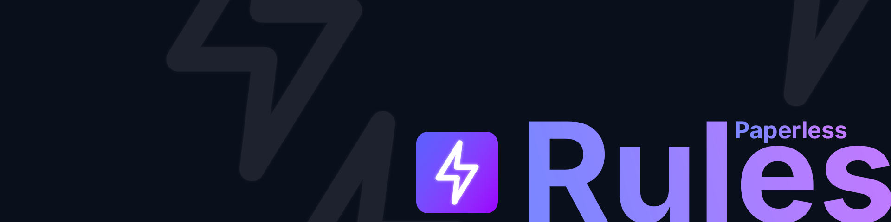

<p align="center">
  
</p>

> An advanced rule engine for Paperless-NGX that brings intelligent automation to your document management workflow.

---

## Table of Contents

- [What is this?](#what-is-this)
- [Key Features](#key-features)
  - [Advanced Rule Engine](#advanced-rule-engine)
  - [AI-Powered Document Analysis](#ai-powered-document-analysis)
  - [Privacy-Focused](#privacy-focused)
  - [Multi-Language Support](#multi-language-support)
  - [Real-Time Processing](#real-time-processing)
- [Installation](#installation)
  - [Prerequisites](#prerequisites)
  - [Quick Start with Docker Compose](#quick-start-with-docker-compose)
  - [Connecting to Paperless-NGX](#connecting-to-paperless-ngx)
  - [Optional: AI Features with Ollama](#optional-ai-features-with-ollama)
  - [Updating](#updating)
  - [Troubleshooting](#troubleshooting)

---

## What is this?

If you're using [Paperless-NGX](https://github.com/paperless-ngx/paperless-ngx) to manage your documents, you've probably run into situations where the built-in rules aren't quite flexible enough. That's where Paperless Rules comes in.

This Laravel-based application connects to your Paperless-NGX instance via API and lets you create sophisticated automation rules that go beyond what's possible out of the box. Think of it as a companion tool that watches your documents and applies complex logic to organize them exactly the way you need.

---

## Key Features

### Advanced Rule Engine
Create multi-condition rules that can handle complex scenarios. Chain conditions together, use AND/OR logic, and trigger multiple actions based on document properties.

### AI-Powered Document Analysis
Integration with [Ollama](https://ollama.ai) lets you use local language models to understand your documents. The AI can extract information like invoice numbers, dates, or amounts, and suggest appropriate tags and categories based on actual content, not just keyword matching.

Here's the important part: the AI doesn't make decisions on its own. It works within your rule framework. For example, when extracting dates, the AI identifies potential dates in the document, but your rules validate them before any changes are applied. You stay in control.

### Privacy-Focused
All AI processing happens locally on your infrastructure. Nothing leaves your system.

### Multi-Language Support
Built-in internationalization makes it easy to use in different languages.

### Real-Time Processing
Documents are processed as they arrive in Paperless-NGX, so your organization stays up to date automatically.

---

## Installation

### Prerequisites

Before you start, make sure you have:
- A running Docker server (e.g., on your home server or NAS)
- A working [Paperless-NGX](https://github.com/paperless-ngx/paperless-ngx) installation
- Your Paperless-NGX API token (you can create one in Paperless-NGX under your profile: click on your username → Edit Profile → API Token)
- (Optional) A running [Ollama](https://ollama.ai) instance if you want to use AI features

### Quick Start with Docker Compose

The easiest way to get Paperless Rules running is with Docker Compose. Here's a complete example configuration:

#### Step 1: Create a compose.yaml file

Create a new folder on your server (e.g., `paperless-rules`) and create a file named `compose.yaml` with the following content:

```yaml
services:
  paperless-rules:
    image: 'ghcr.io/avratny/paperless-rules:latest'
    container_name: paperless-rules
    ports:
      - '8080:80'  # Change 8080 to any port you prefer
    networks:
      - paperless-rules-internal
      - paperless-rules
    depends_on:
      - mariadb
    environment:
      # Application Settings
      APP_KEY: 'base64:GENERATE_YOUR_OWN_KEY_HERE'  # See Step 2 below
      APP_URL: 'http://localhost:8080'  # Change to your actual URL

      # Database Settings
      DB_CONNECTION: mysql
      DB_HOST: mariadb
      DB_PORT: 3306
      DB_DATABASE: paperless_rules
      DB_USERNAME: paperless_rules
      DB_PASSWORD: 'ChangeThisToASecurePassword'  # Change this!

  mariadb:
    image: 'mariadb:11'
    container_name: paperless-rules-db
    environment:
      MYSQL_ROOT_PASSWORD: 'ChangeThisToASecureRootPassword'  # Change this!
      MYSQL_DATABASE: 'paperless_rules'
      MYSQL_USER: 'paperless_rules'
      MYSQL_PASSWORD: 'ChangeThisToASecurePassword'  # Must match DB_PASSWORD above
    volumes:
      - 'paperless-rules-db:/var/lib/mysql'
    networks:
      - paperless-rules-internal
    restart: unless-stopped

networks:
  paperless-rules-internal:
  paperless-rules:
    driver: bridge

volumes:
  paperless-rules-db:
    driver: local
```

#### Step 2: Generate an Application Key

The `APP_KEY` is important for security. Generate one by running:

```bash
docker run --rm ghcr.io/avratny/paperless-rules:latest php artisan key:generate --show
```

Copy the output (it looks like `base64:...`) and replace `GENERATE_YOUR_OWN_KEY_HERE` in your `compose.yaml` file.

#### Step 3: Customize the Configuration

Before starting, make sure to change:
- **Port** (line 6): Change `8080` to any port you want to use
- **APP_URL** (line 15): Change to your actual URL (e.g., `http://192.168.1.100:8080` or `https://paperless-rules.yourdomain.com`)
- **Passwords** (lines 24 and 35): Choose strong, unique passwords
- **APP_KEY** (line 13): Use the key you generated in Step 2

#### Step 4: Start the Application

In the folder where you created the `compose.yaml` file, run:

```bash
docker compose up -d
```

This will download the necessary images and start the application. The first start may take a few minutes.

#### Step 5: Access the Application

Open your web browser and go to:
```
http://your-server-ip:8080
```

For example: `http://192.168.1.100:8080`

You should see the Paperless Rules login page. The application will guide you through the initial setup where you'll configure:
1. Your Paperless-NGX connection (URL and API token)
2. (Optional) Your Ollama connection for AI features
3. Create your admin account

### Connecting to Paperless-NGX

During the initial setup, you'll need:
- **Paperless-NGX URL**: The full URL to your Paperless instance (e.g., `http://192.168.1.50:8000`)
- **API Token**: Create one in Paperless-NGX by clicking on your username → Edit Profile → API Token

### Optional: AI Features with Ollama

If you want to use AI-powered document analysis:

1. Install [Ollama](https://ollama.ai) on your server or another machine
2. Pull a model (e.g., `ollama pull llama3.1`)
3. In Paperless Rules settings, configure:
   - **Ollama URL**: e.g., `http://192.168.1.50:11434`
   - **Model**: e.g., `llama3.1`

### Updating

To update to the latest version:

```bash
docker compose pull
docker compose up -d
```

### Troubleshooting

**Application won't start:**
- Check the logs: `docker compose logs paperless-rules`
- Make sure the database password matches in both services
- Verify that the APP_KEY is set correctly

**Can't connect to Paperless-NGX:**
- Make sure the Paperless-NGX URL is accessible from the Docker container
- Verify your API token is correct and active
- Check if Paperless-NGX is running

**Database errors:**
- The database is created automatically on first start
- If you see migration errors, wait a minute and check the logs again

---

## License

This project is open-source software licensed under the [MIT License](LICENSE).

You are free to use, modify, and distribute this software. See the LICENSE file for full details.

---
